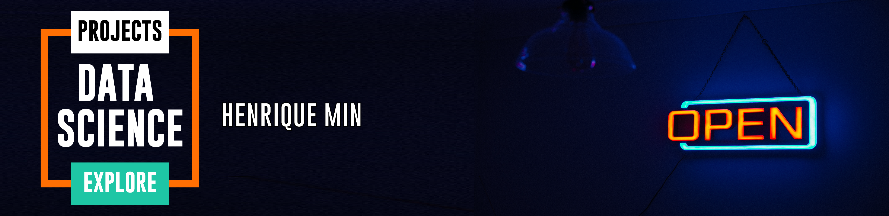

  

# Henrique Min
Data Analytics | Data Science | Sales | Trade Marketing

Professional graduated in Marketing degree with experience in areas as Trade Marketing and Corporate events, being responsible for: management, strategy, planning and execution of promotional campaigns and POS actions and ability to manage corporate events since the briefing, negotiation with suppliers until disassembly.

I also have experience in Business Intelligence and Data Analysis doing data extraction and manipulation, sales analysis, reports and dashboards, generating insights and supportting recommendations to decision making, as well as negotiating with clients on goals, investiments and action plans.

Currently, I am looking to combine my experience in areas of Marketing and Sales with Data Science to improve and automate processes and find solutions that generate a high impact and increase sales in retail market.

Professional Skills:
Excel, SQL, Power BI, Python, Google Analytics.

Quickly learning, Problem solving, Collaboration, Leadership, Planning, Strategy development.

**Link:**
* [LinkedIn](https://www.linkedin.com/in/henriquemin/)

## Projects:

* **Data Science: Titanic Analysis and Survival Prediction:** http://bit.ly/37onfKM
* **Data Science: Pima Indians Analysis and Diabetes Prediction:** http://bit.ly/37ranDQ
* **Data Science: Brazilian e-commerce Sales Analysis with Plotly:** http://bit.ly/2SK5vEm
---
Photo by Ben Taylor from Pexels
